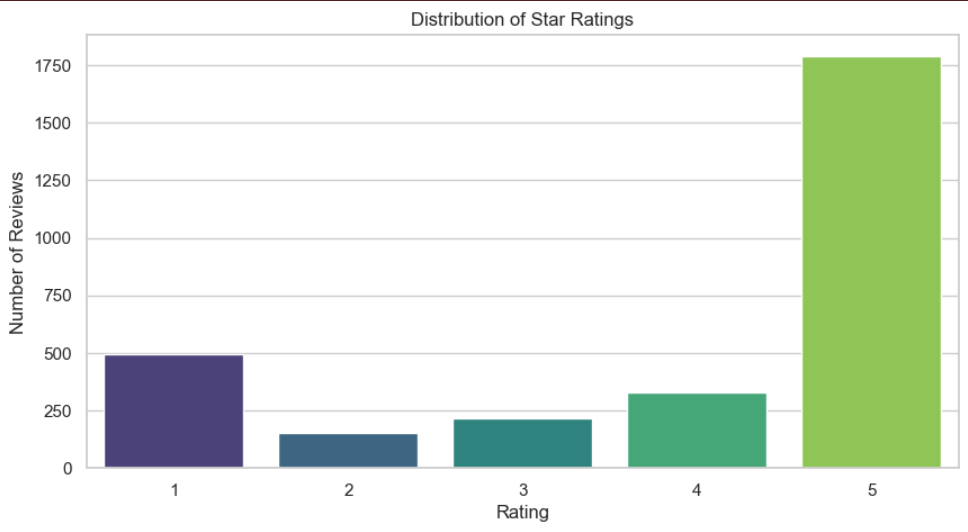
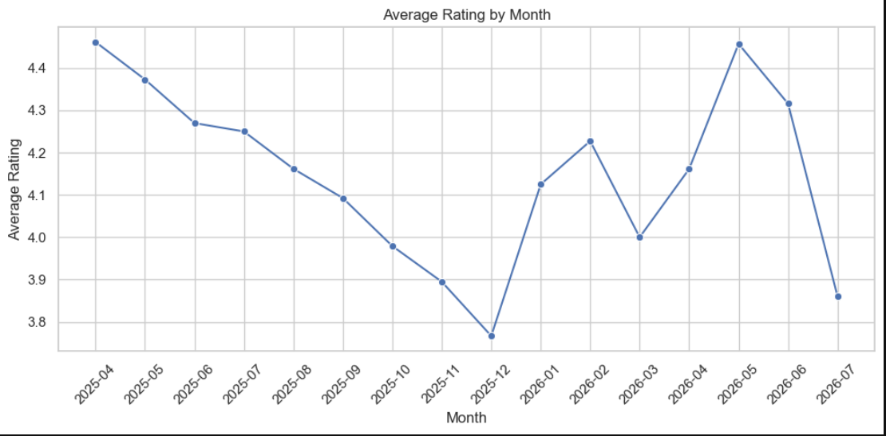
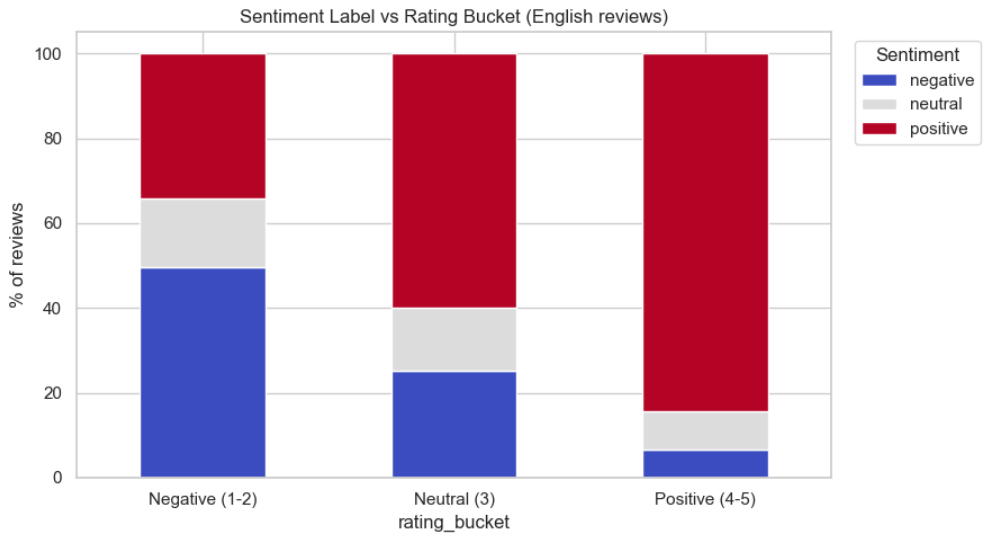
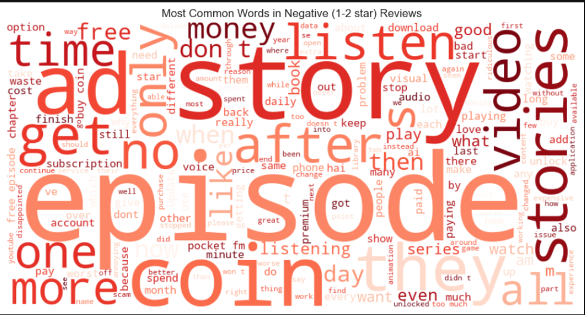
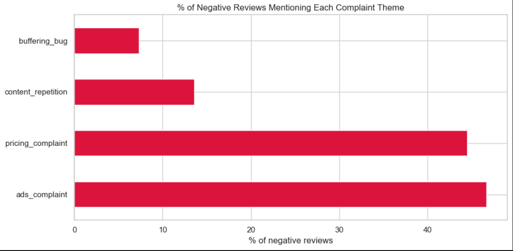

<div align="center">


<br/>

<a href="https://github.com/TechNamrata/PocketFM-Review-Analysis">
  
</a>

<br/>


</div>

<br/>

> 🎯 **What this is:** An end-to-end NLP + data mining pipeline that scrapes real Google Play Store reviews for **Pocket FM: Audio Series**, cleans them, mines them for churn signals and complaint themes, and turns the findings into a growth-analyst-ready recommendation — the same workflow a Growth/Product Analyst runs before a roadmap meeting.

<div align="center">

### 🔁 The Pipeline

```mermaid
flowchart LR
    A[📲 Fetch Reviews] --> B[🧹 Clean & Dedupe]
    B --> C[🌐 Language Detect]
    C --> D[⚙️ Feature Engineer]
    D --> E[💬 VADER Sentiment]
    E --> F[🎯 Theme Extraction]
    F --> G[📊 Growth Insight Memo]

    style A fill:#a855f7,stroke:#fff,color:#fff
    style B fill:#8b5cf6,stroke:#fff,color:#fff
    style C fill:#7c3aed,stroke:#fff,color:#fff
    style D fill:#6d28d9,stroke:#fff,color:#fff
    style E fill:#5b21b6,stroke:#fff,color:#fff
    style F fill:#4c1d95,stroke:#fff,color:#fff
    style G fill:#a855f7,stroke:#fff,color:#fff
```



</div>

---

## ✨ Key Highlights

<table>
<tr>
<td width="50%" valign="top">

**🌐 Multilingual Scraping**
2,970+ reviews pulled live via `google-play-scraper` across English & Hindi locales

**🧹 Robust Cleaning Pipeline**
Dedup → missing-value drop → emoji flag/strip → URL & noise removal → per-review language detection

**💬 Sentiment Intelligence**
VADER sentiment on English reviews, cross-checked against star ratings to catch mismatches (sarcastic 5★, disguised complaints)

</td>
<td width="50%" valign="top">

**🔍 Complaint Theme Mining**
Word-frequency + word cloud on 1–2★ reviews to surface what users actually complain about

**🏷️ Business-Level Tagging**
Keyword buckets — **pricing · buffering/bugs · repetition · ads** — map raw text to concrete product levers

**📈 Churn-Risk Trendlines**
Month-over-month average rating to flag retention danger zones before they spiral

</td>
</tr>
</table>

---

## 📊 Results at a Glance

<div align="center">
<table>
<tr>
<td align="center"><h2>2,970+</h2>Reviews Analyzed</td>
<td align="center"><h2>3.94★</h2>Average Rating</td>
<td align="center"><h2>21.5%</h2>Negative Reviews</td>
<td align="center"><h2>Ads</h2>Top Complaint Theme</td>
</tr>
</table>
</div>

> ✅ *Numbers and visuals below are from an actual live run of the notebook on real, scraped Play Store data.*

---

## 🖼️ Visual Walkthrough

<div align="center">

### ⭐ Star Rating Distribution


<br/><br/>

### 📈 Average Rating Trend Over Time


<br/><br/>

### 💬 Sentiment vs Star Rating (Cross-Check)


<br/><br/>

### ☁️ What Users Complain About Most


<br/><br/>

### 🎯 Complaint Themes Mapped to Product Levers


</div>

---

## 🛠️ Tech Stack
<div align="center">

<table>
<tr>
<th align="center">Category</th>
<th align="center">Tools</th>
</tr>
<tr>
<td align="center"><b>💻 Language</b></td>
<td align="center">

</td>
</tr>
<tr>
<td align="center"><b>📥 Data Collection</b></td>
<td align="center">

</td>
</tr>
<tr>
<td align="center"><b>🧮 Data Wrangling</b></td>
<td align="center">


</td>
</tr>
<tr>
<td align="center"><b>🧠 NLP / Sentiment</b></td>
<td align="center">


</td>
</tr>
<tr>
<td align="center"><b>📊 Visualization</b></td>
<td align="center">


</td>
</tr>
<tr>
<td align="center"><b>📓 Environment</b></td>
<td align="center">

</td>
</tr>
</table>

</div>

---

## 📂 Repository Structure
```
PocketFM-Review-Analysis/
├── PocketFM_Review_Analysis.ipynb   # Full analysis pipeline (fetch → insights)
├── requirements.txt                  # Python dependencies
├── rating_distribution.png           # Chart: star rating distribution
├── monthly_rating_trend.png          # Chart: average rating over time
├── sentiment_vs_rating.png           # Chart: sentiment vs rating cross-check
├── wordcloud_negative.png            # Word cloud of negative reviews
├── complaint_themes.png              # Chart: top complaint themes
├── .gitignore
└── README.md
```
> 💡 Raw/cleaned CSVs (`pocketfm_reviews_raw.csv`, `pocketfm_reviews_cleaned.csv`) are generated by running the notebook and aren't committed — re-run the fetch cells anytime for a fresh dataset.

---

## ⚙️ Setup & Usage

```bash
# 1. Clone the repo
git clone https://github.com/TechNamrata/PocketFM-Review-Analysis.git
cd PocketFM-Review-Analysis

# 2. Install dependencies
pip install -r requirements.txt

# 3. Launch the notebook
jupyter notebook PocketFM_Review_Analysis.ipynb
```

Run the cells top to bottom — the notebook fetches **live** reviews from the Play Store, so your results reflect current, real-world data.

---

## 🔮 Possible Extensions

- 🆚 Compare Pocket FM against a competitor app's reviews
- 🌍 Translate non-English reviews for deeper cross-lingual theme analysis
- 📊 Build a live dashboard (Streamlit / Power BI) on top of the cleaned dataset
- 🚀 Track sentiment/theme shifts around specific app version releases

---

## 💡 Growth Insight Summary

> Across **2,970 reviews** analyzed, the average rating is **3.94/5**, with **21.5%** falling into the 1–2 star (negative) bucket. Among negative reviews, **ad frequency** (~47%) and **pricing/coin costs** (~45%) are the two dominant complaint themes — far ahead of content repetition (~14%) and buffering/technical bugs (~8%). Sentiment analysis confirms this: **50% of negative-rated English reviews carry explicitly negative sentiment text**, validating that low ratings are driven by genuine dissatisfaction rather than noise. The clear recommendation: prioritize **ad-load reduction** and **pricing transparency** as the two highest-leverage retention fixes, since together they account for the vast majority of user friction in this dataset.

---

<div align="center">

## 👤 Author

**Namrata Nayak**
B.Tech · Electronics and Communication Engineering · NIT Silchar

[](https://namratakrishna.wixsite.com/namrata-nayak)
[](https://www.linkedin.com/in/namrata-nayak)
[](https://github.com/TechNamrata)

<br/>

⭐ **If this project helped you, consider giving it a star!** ⭐


</div>
